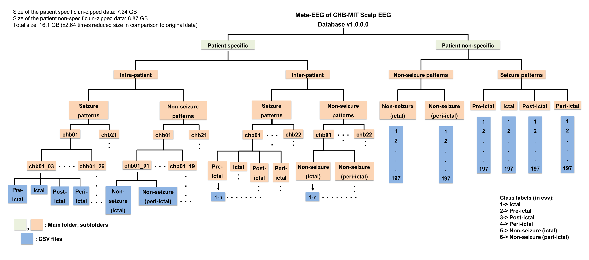
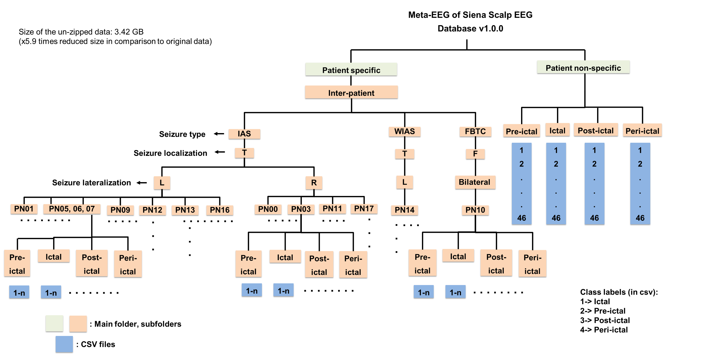

# Meta-EEG of CHB-MIT Scalp EEG Database v1.0.0.0 and Siena Scalp EEG Database v1.0.0

## Overview

The **CHB-MIT Scalp EEG Database** is a well-known dataset containing EEG recordings from pediatric patients diagnosed with epilepsy. These records provide an essential resource for the study of seizure activity and the development of automated methods for epilepsy detection, prediction, and management. The **CHB-MIT Meta EEG Dataset** released here contains **balanced, annotated, fixed-time, and length meta-data** of the CHB-MIT Scalp EEG database v1.0.0.0, focused on patient-specific (inter and intra) and patient non-specific EEG data. The dataset includes key segments from **ictal**, **pre-ictal**, **post-ictal**, **peri-ictal**, and **non-seizure** periods. These segments have been extracted from the original CHB-MIT dataset using specific time stamps and annotations.

The **Siena Scalp EEG Database** is a dataset of EEG recordings aimed at advancing artificial intelligence (AI)-based automated epilepsy diagnosis. With growing access to large, raw EEG datasets, there is an increasing need for data standardization in AI models to reduce redundant information and improve the accuracy of seizure detection, prediction, and management. The **Siena Meta EEG Dataset** provides **balanced, annotated, fixed-time, and length meta-data** extracted from the Siena Scalp EEG database v1.0.0. The dataset includes **patient inter-specific** and **patient non-specific** EEG data based on specific time stamps for various seizure-related periods: ictal, pre-ictal, post-ictal, and peri-ictal. The provided metadata is in CSV format and includes class labels for each segment.

The metadatas generated from these dataset will help researchers and practitioners working with AI-based seizure detection models by providing them with standardized, non-redundant EEG data.
The metadata can be directly downloaded from zenodo: [Data of Meta-EEGs](https://figshare.com/articles/dataset/Data_of_Meta-EEGs/30000775)


### The metadata includes:
#### CHB-MIT Dataset:
- **Patient-Specific Data**: Contains inter- and intra-patient EEG data.
- **Patient Non-Specific Data**: Includes non-patient-specific segments.
- **Time Stamps**: Includes ictal, pre-ictal, post-ictal, peri-ictal, and non-seizure time segments.
- **Exclusions**: Data for channels ch06, ch12, ch23, ch24 in patient-specific and chb24_11 in patient non-specific have not been included.
  

#### Siena Scalp Daataset:
- **Patient-Specific Data**: Contains inter-patient EEG data across different individuals.
- **Patient Non-Specific Data**: Includes EEG data that is not specific to any single patient.
- **Time Stamps**: Includes ictal, pre-ictal, post-ictal, and peri-ictal segments as annotated in the original database.
- **Exclusions**: The data for patient **PN00-3** has been excluded from this release.



---

## Steps to Generate CHB-MIT Meta EEG Dataset
### Step 1: Download CHB-MIT EEG Data
1. Download the **CHB-MIT Scalp EEG dataset** (available from the [CHB-MIT database website](https://physionet.org/content/chbmit/1.0.0/)).
2. Place all the **EDF files** (electroencephalogram data) in a folder named `chb_edf_dataset`.
3. Place the **CHB-MIT DB timestamp.csv** (which contains the relevant time stamps), **code_chbmit.ipynb** (Jupyter Notebook) and **data_preprocess_chbmit.py** files in the **same directory** as the above folder.

### Step 2: Data Preprocessing
1. Run the `data_preprocess_chbmit.py` file to preprocess the EEG data. This script will load the raw EEG data, perform any necessary cleaning, and prepare the data in a structure ready for metadata generation.
2. After running `data_preprocess_chbmit.py`, the processed data will be saved in a folder called `final_data`.

### Step 3: Set Up the Directory
Ensure that the following directory structure exists in your workspace:
   - `final_data/` — Folder containing data will be stored.
   - `Main Dataset/` — Directory where the final meta-data will be created.
   - `chb_csv/` — A temporary folder used during the metadata generation process.

### Step 4: Run the Jupyter Notebook
1. Open and run the **code.ipynb** Jupyter Notebook.
   - The notebook will process the preprocessed data and generate the meta-data (including time stamps for ictal, pre-ictal, post-ictal, peri-ictal, and non-seizure events) from the original CHB-MIT dataset.
   - The final **meta-data** will be saved in the `Main Dataset/` directory.

### Final Output:
- After running the notebook, the meta-data files will be available in the **Main Dataset** folder in **CSV** format. The class labels will be included in the last row of each CSV file.
---
## Steps to Generate Siena Scalp EEG Meta Dataset
### Step 1: Download Siena EEG Data
1. Download the **Siena Scalp EEG dataset** (available from the [Siena Scalp database website](https://physionet.org/content/siena-scalp-eeg/1.0.0/))
3. Place all the **EEG files** in a folder named `siena_edfs`.
4. Place the **Siena DB timestamp.csv** (which contains relevant time stamps) and other required files like **code_siena.ipynb** (Jupyter Notebook) and **data_preprocess_siena.py** in the **same directory** as the `siena_edfs` folder.

### Step 2: Data Preprocessing
1. Run the `data_preprocess_siena.py` file to preprocess the EEG data. This script will clean the raw EEG data and prepare it for the generation of metadata.
2. After running `data.py`, the preprocessed data will be saved in a folder called `edf_files`.

### Step 3: Set Up the Directory
Ensure that the following directory structure exists in your workspace:
   - `edf_files/` — Folder to store the preprocessed data.
   - `Generated siena db/` — Directory where the final metadata will be saved.
   - `temp/` — A temporary folder used during metadata generation.

### Step 4: Run the Jupyter Notebook
1. Open and run the **code_siena.ipynb** Jupyter Notebook.
   - The notebook will process the preprocessed data and generate the meta-data (including time stamps for ictal, pre-ictal, post-ictal, peri-ictal, and non-seizure events) from the original Siena Scalp EEG dataset.
   - The final **meta-data** will be saved in the `Generated siena db/` directory.

### Final Output:
- After running the notebook, the meta-data files will be available in the **Main Dataset** folder in **CSV** format. The class labels will be included in the last row of each CSV file.

---

## File Structure

The repository contains the following key files and directories:

- **`data_preprocess_chbmit.py`**: Python script for prepare the CHBMIT data files.
- **`data_preprocess_siena.py`**: Python script for prepare the Siena Scalp data files.
- **`code_chbmit.ipynb`**: Jupyter notebook for generating the meta-data for CHBMIT dataset.
- **`code_siena.ipynb`**: Jupyter notebook for generating the meta-data for Siena Scalp dataset.
- **`CHB-MIT DB timestamp.csv`**: CSV file containing the time stamps for ictal, pre-ictal, post-ictal, peri-ictal, and non-seizure segments.
- **`Siena DB timestamp.csv`**: CSV file containing the time stamps for ictal, pre-ictal, post-ictal, peri-ictal, and non-seizure segments.


## References  
   - **BibTeX**:
     ```bibtex
     @article{Handa2025,
      author = "Palak Handa and Manya Joshi and Esha Gupta and Ramona Woitek",
      title = "{Data of Meta-EEGs}",
      year = "2025",
      month = "8",
      url = "https://figshare.com/articles/dataset/Data_of_Meta-EEGs/30000775",
      doi = "10.6084/m9.figshare.30000775.v1"
      }
     ```
   - **Link**: [Data of Meta-EEGs](https://figshare.com/articles/dataset/Data_of_Meta-EEGs/30000775)

---

**Feel free to contribute, raise issues, or suggest improvements!**
